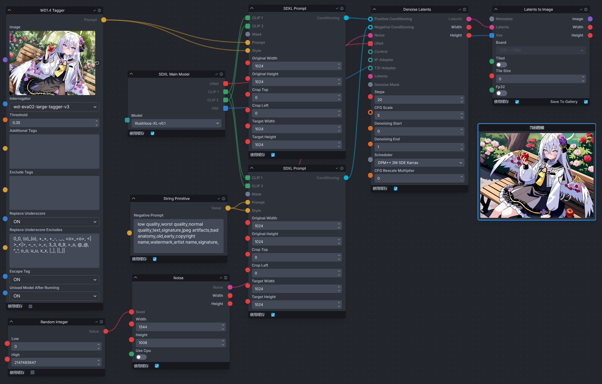

<div align="center">

# Invoke WD14 Tagger

_✨使用各种模型从图片获取 Danbooru 风格的提示词_

📓 · [Documents](./README.md) · [中文文档](./README-zh.md)
</div>


## 简介
一个为 [InvokeAI](https://github.com/invoke-ai/InvokeAI) 添加 WD1.4 Tagger 节点的扩展，可从图片反推提示词用于图片生成。该节点移植自 [sd-webui-wd14-tagger](https://github.com/Akegarasu/sd-webui-wd14-tagger)。


## 安装
进入 InvokeAI 的节点目录（`invokeai/nodes`），若不清楚该路径在哪，可通过启动 InvokeAI 时终端显示的信息找到。

例如，InvokeAI 在启动时将显示 InvokeAI 的根目录。

```
[2024-10-03 22:01:25,401]::[InvokeAI]::INFO --> Root directory = E:\Softwares\InvokeAI\invokeai
```

从终端中可以知道 InvokeAI 的根目录在`E:\Softwares\InvokeAI\invokeai`，安装节点前就需要进入该目录中（`E:\Softwares\InvokeAI\invokeai\nodes`）。

进入 InvokeAI 的节点目录后，打开终端，输入下面的命令进行安装。

```
git clone https://github.com/licyk/invoke_wd14_tagger
```

或者将该 Github 仓库下载下来，并解压到该目录中。

安装完成后需重启 InvokeAI。


## 使用
进入 InvokeAI 的工作流中，在添加节点处搜索`WD1.4 Tagger`节点并添加。

在`invoke_wd14_tagger/workflow`中可有示例工作流，可导入并使用。

在运行工作流时，可从终端查看反推的提示词，例如。

```
[2024-10-04 20:40:35,108]::[InvokeAI-WD14-Tagger]::INFO --> Tagging Image Done
====================================================================================================
Prompt:
1girl, azusa \(blue archive\), flower, food, solo, bench, holding food, wings, fruit, hair ornament, long hair, apple, rose, hair flower, holding, hair between eyes, halo, purple flower, park bench, dress, black dress, white wings, white jacket, on bench, jacket, sitting on bench, long sleeves, white hair, pink flower, holding fruit, low wings, looking at viewer, purple eyes, pink rose, outdoors, frills, sitting, blush, crossed bangs, feathered wings, red flower, closed mouth, bush, red apple, black sailor collar, yellow neckerchief, red rose, sailor collar, dutch angle, frilled dress, pink eyes, tree, angel wings, open jacket, open clothes, very long hair, yellow halo, puffy sleeves, puffy long sleeves, park, day
====================================================================================================
```


## 鸣谢
- [@Akegarasu](https://github.com/Akegarasu) - 提供 Tagger 源码。
- [#SmilingWolf](https://huggingface.co/SmilingWolf) - 提供 Tagger 模型。