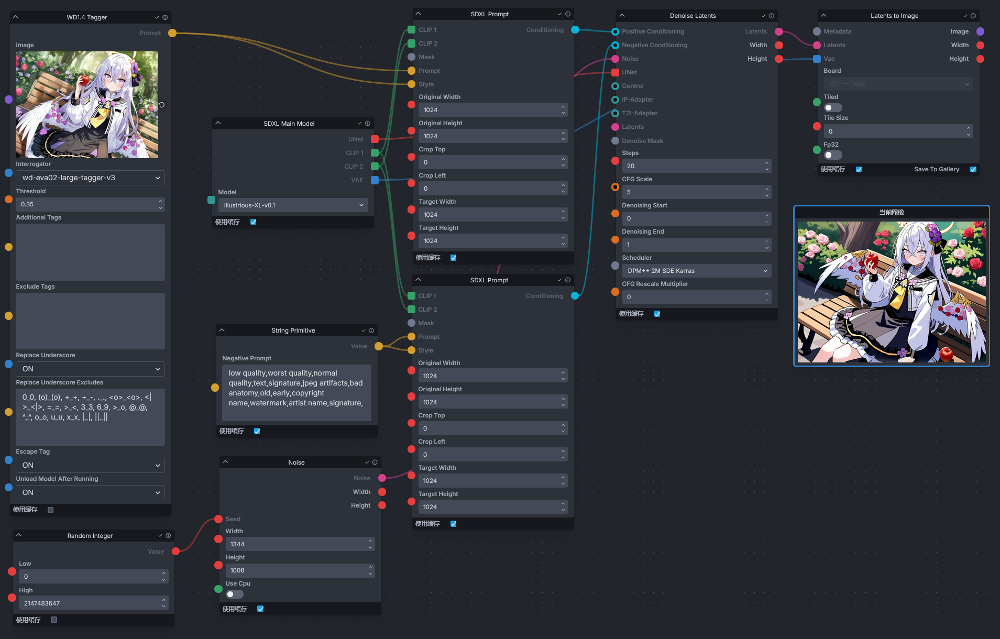

<div align="center">

# Invoke WD14 Tagger

_✨Interrogate booru style tags for image using various models_

📓 · [Documents](./README.md) · [中文文档](./README-zh.md)
</div>


## Info  
An extension that adds a WD1.4 Tagger node for [InvokeAI](https://github.com/invoke-ai/InvokeAI), which can interrogate prompt from images for image generation. This node is ported from [sd-webui-wd14-tagger](https://github.com/Akegarasu/sd-webui-wd14-tagger).


## Install
Navigate to the InvokeAI nodes directory (`invokeai/nodes`). If you are unsure of the path, you can find it by looking at the information displayed in the terminal when starting InvokeAI.

For example, when InvokeAI starts, it will display the root directory of InvokeAI.

```
[2024-10-03 22:01:25,401]::[InvokeAI]::INFO --> Root directory = E:\Softwares\InvokeAI\invokeai
```

From the terminal, you can see that the root directory of InvokeAI is at `E:\Softwares\InvokeAI\invokeai`, and you need to enter this directory (`E:\Softwares\InvokeAI\invokeai\nodes`) before installing the node.

Once you are in the InvokeAI nodes directory, open the terminal and enter the following command to install.

```
git clone https://github.com/licyk/invoke_wd14_tagger
```

Alternatively, download the GitHub repository and unzip it into the directory.

Restart InvokeAI after the installation is complete.


## Use
Within the InvokeAI workflow, search for the `WD1.4 Tagger` node and add it when you are at the point of adding nodes.

There are example workflows available in `invoke_tipo/workflow` that you can import and use.

While running the workflow, you can view the prompted keywords from the terminal, for example.

```
[2024-10-04 20:40:35,108]::[InvokeAI-WD14-Tagger]::INFO --> Tagging Image Done
====================================================================================================
Prompt:
1girl, azusa \(blue archive\), flower, food, solo, bench, holding food, wings, fruit, hair ornament, long hair, apple, rose, hair flower, holding, hair between eyes, halo, purple flower, park bench, dress, black dress, white wings, white jacket, on bench, jacket, sitting on bench, long sleeves, white hair, pink flower, holding fruit, low wings, looking at viewer, purple eyes, pink rose, outdoors, frills, sitting, blush, crossed bangs, feathered wings, red flower, closed mouth, bush, red apple, black sailor collar, yellow neckerchief, red rose, sailor collar, dutch angle, frilled dress, pink eyes, tree, angel wings, open jacket, open clothes, very long hair, yellow halo, puffy sleeves, puffy long sleeves, park, day
====================================================================================================
```


## Acknowledgement
- [@Akegarasu](https://github.com/Akegarasu) - Provide Tagger source code.
- [@SmilingWolf](https://huggingface.co/SmilingWolf) - Provide Tagger model.
